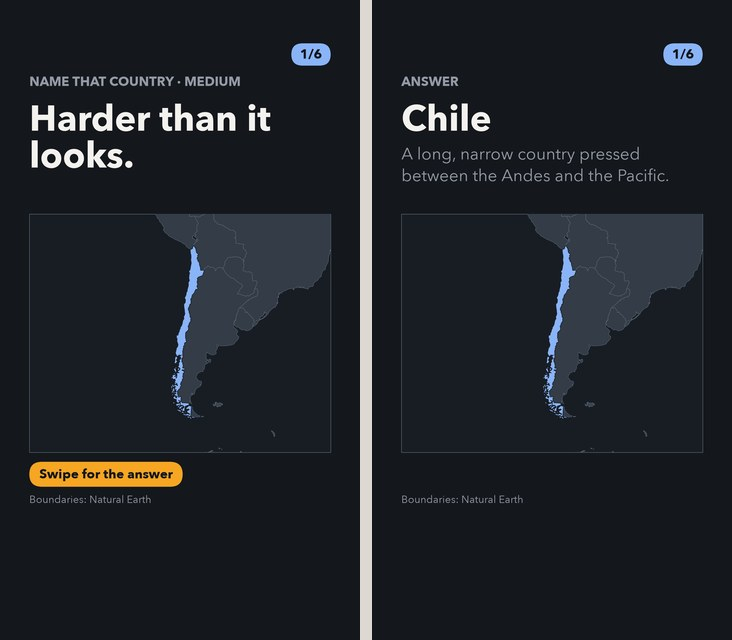
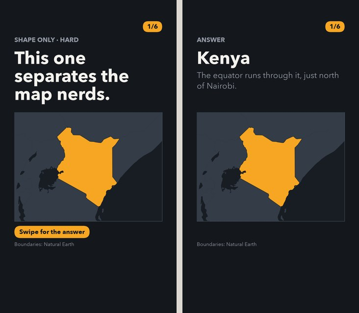
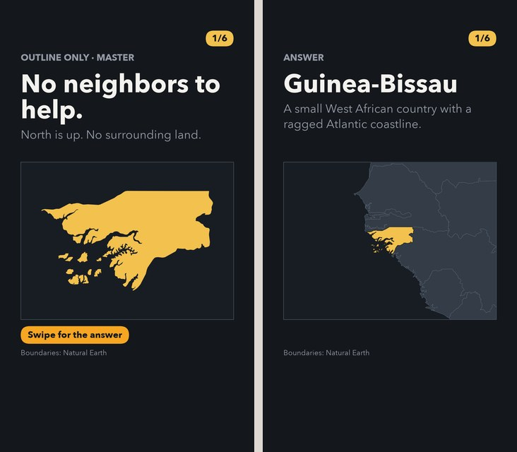
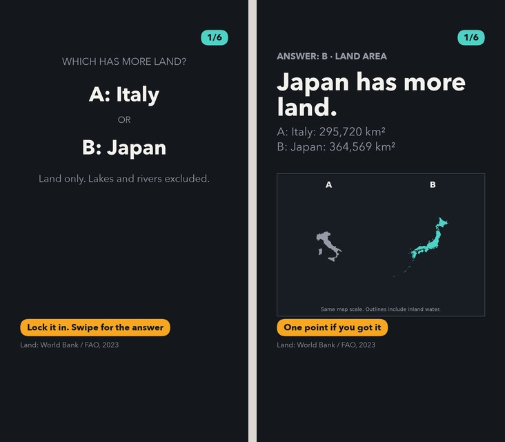
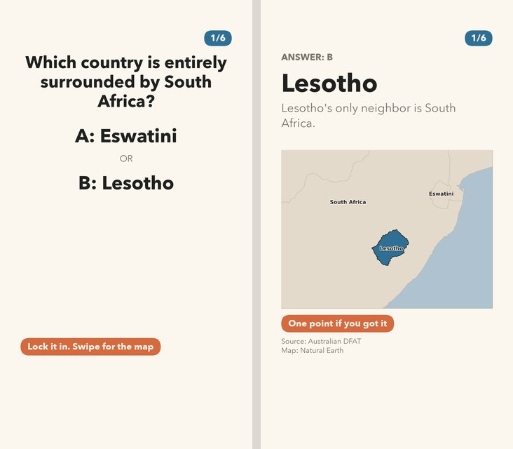
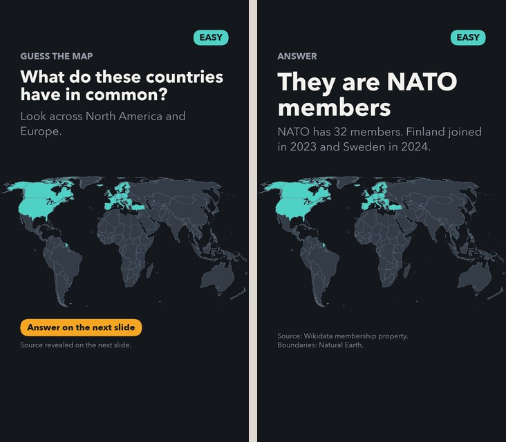
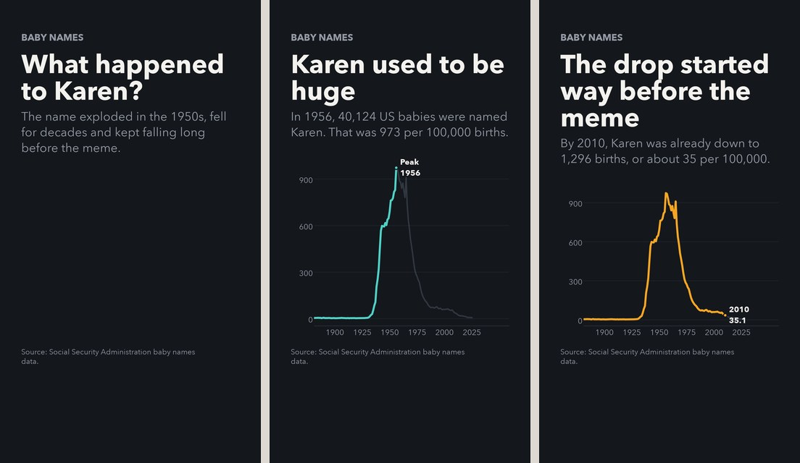

# Examples

A gallery of rendered posts for TikTok carousels and YouTube Shorts. These are selected slide sequences, read left to right, rather than full posts. Click a preview to enlarge it.

[Setup and all commands](README.md#setup) · [Geography quiz guide](docs/geo-quiz-rollout.md)

The commands below create or render examples after setup. Commands that select a new quiz batch rotate countries, so your picks may differ.

## Globe quiz

Name the country in red on a globe, then swipe for the answer. Country selection follows the requested difficulty tier.

[](docs/examples/globe-quiz.jpg)

```bash
make quiz-globe TIER=hard COUNT=3
```

[Sample metadata](posts/geo-quiz/geo-globe-hard-001/night/post.json)

## Progressive quiz

A tight prompt, a wider hint and the answer. Country selection and framing both follow the difficulty tier.

[](docs/examples/progressive-quiz.jpg)

```bash
make quiz-progressive TIER=hard COUNT=3
```

[Sample metadata](posts/geo-quiz/geo-progressive-hard-001/night/post.json)

## Classic geography quiz

Identify the highlighted country with neighboring borders visible, then reveal its name and a fact.

[](docs/examples/classic-geography-quiz.jpg)

```bash
make quiz TIER=medium COUNT=3
```

[Sample metadata](posts/geo-quiz/geo-medium-001/night/post.json)

## Silhouette quiz

Country shapes and surrounding land without neighboring borders. This variant draws from the whole pool; difficulty controls the amount of context.

[](docs/examples/silhouette-quiz.jpg)

```bash
make quiz-silhouette TIER=hard COUNT=3
```

[Sample metadata](posts/geo-quiz/geo-silhouette-hard-001/night/post.json)

## Master outline quiz

An isolated outline with no surrounding land. The answer restores regional context. Candidates come from the expert pool.

[](docs/examples/master-outline-quiz.jpg)

```bash
make quiz TIER=master COUNT=3
```

[Sample metadata](posts/geo-quiz/geo-master-001/night/post.json)

## Land-area comparison

Choose which country has more land, then compare outlines drawn at the same scale.

[](docs/examples/land-area-comparison.jpg)

```bash
make area-quiz
```

[Sample metadata](posts/area-quiz/area-001/night/post.json)

## Neighbors quiz

An A/B question about borders, followed by a labeled map explanation. This example uses the paper theme.

[](docs/examples/neighbors-quiz.jpg)

```bash
make neighbors-quiz THEME=paper
```

[Sample metadata](posts/neighbors-quiz/neighbors-001/paper/post.json)

## Mystery map

Guess what the highlighted countries have in common, then reveal the grouping.

[](docs/examples/mystery-map.jpg)

```bash
uv run tiktoks catalog --slug nato-members
```

[Sample metadata](posts/guess-map/nato-members/night/post.json)

## Data story

The opening three slides of a story about the name Karen, built from Social Security baby-name data.

[](docs/examples/data-story.jpg)

```bash
make karen
```

[Sample metadata](posts/stories/2026-ssa-name-karen/post.json)

## Refreshing the gallery

The compact JPEG previews in `docs/examples/` are versioned so this page works on GitHub without downloading or rendering the full posts. Full-size slide exports remain ignored. After rendering the sample posts listed in [the gallery script](scripts/build_examples.py), refresh the previews and this page with:

```bash
uv run python scripts/build_examples.py
```
