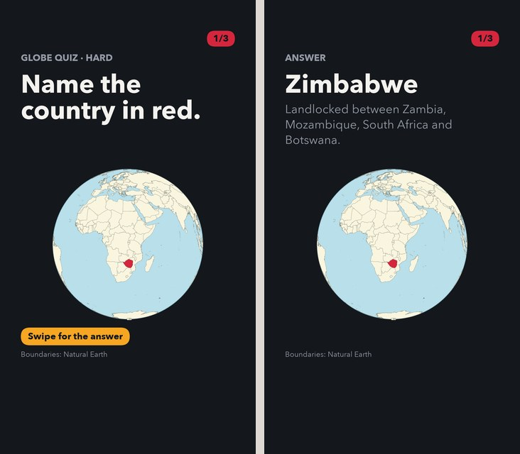

# TikTok stories

Code-driven geography quizzes, mystery maps and data stories for TikTok and
YouTube Shorts. Posts start as `1080x1920` PNG slides; TikTok uses the carousel,
and Shorts uses an MP4 assembled from the same sequence.

**[Browse the example gallery](EXAMPLES.md)** to compare the formats visually.

[](EXAMPLES.md)

## Choose a workflow

All formats use code to render. The difference is who chooses the questions,
provides the answers and decides what the maps should show.

| Workflow | Formats | Code handles | Editorial control |
| --- | --- | --- | --- |
| Country pool | Classic, globe, silhouette, progressive, Master outline | Country rotation, batch config, framing defaults, slides and scorecard | Maintain country tiers, facts and overrides; choose format and tier; review each batch |
| Curated question configs | Land-area comparison, neighbors | Render a supplied question list; compute land-area winners from saved values | Select comparisons, source values and wording; explicitly set neighbors answers, explanations and map labels |
| Query catalog or local CSV | Mystery maps (`guess-map`) | Fetch/cache data, join countries, validate expected counts and draw maps | Choose the premise, query, definitions, corrections, answer and explanation; verify the mapped result |
| Custom story | Data stories, including SSA name stories | Run story-specific fetch, process and render scripts | Define the angle, analysis, sequence, charts and copy |

The country pool is the only workflow with automatic next-batch selection and
shared country usage tracking. A list of ideas in `docs/` is a planning aid;
it does not become a runnable post until a config or story implementation exists.
Every workflow still needs editorial and visual review before publishing.

[Setup](#setup) · [Country quizzes](#country-quizzes) ·
[Curated quizzes](#curated-comparison-quizzes) · [Mystery maps](#mystery-maps) ·
[Stories](#data-stories) · [Review and publish](#review-and-publish) ·
[Repo layout](#repo-layout)

## Setup

Run commands from the repository root:

```bash
uv sync --extra dev
uv run python scripts/build_crosswalk.py
```

The crosswalk is required for ISO-code joins to Wikidata and World Bank data.
Reference boundaries and source data are fetched and cached as needed, so first
runs need network access. Video assembly also requires `ffmpeg` on PATH;
YouTube upload has [additional setup](#youtube-shorts).

## Country quizzes

### Pick the format

| Format | What viewers see | Country selection | Create one new post |
| --- | --- | --- | --- |
| Classic | Highlighted country with neighboring borders → name and fact | Requested tier | `make quiz TIER=medium COUNT=3` |
| Globe | Country in red on a globe → answer | Requested tier | `make quiz-globe TIER=hard COUNT=3` |
| Silhouette | Country shape and surrounding land without neighboring borders → answer | Whole pool; tier controls context | `make quiz-silhouette TIER=hard COUNT=3` |
| Progressive | Tight prompt → wider hint → answer | Requested tier; tier also controls framing | `make quiz-progressive TIER=medium COUNT=3` |
| Master outline | Isolated, north-up outline → regional answer map | Expert pool and shared usage | `make quiz TIER=master COUNT=6` |

`COUNT` is countries in **one post**, not the number of posts. Ordinary tiers
are `easy`, `medium`, `hard` and `expert`. Master is a special outline format:
use `--tier master` without `--variant`.

The Make shortcuts above use the default `night` theme. To choose `paper` or
`poster`, use the CLI's `--theme` option:

```bash
uv run tiktoks quiz next --tier hard --count 3 --variant globe --theme paper
```

### Preview, create or edit a batch

```bash
# Inspect pool depth; validate country names against the detailed boundaries.
uv run tiktoks quiz status --validate

# Preview picks without creating files or changing usage.
uv run tiktoks quiz next --tier medium --count 3 --dry-run

# Create and render the next numbered batch.
uv run tiktoks quiz next --tier medium --count 3

# Or save a named batch for editorial changes before rendering.
uv run tiktoks quiz next --tier medium --count 3 --slug my-medium-quiz --no-render
# Edit posts/geo-quiz/my-medium-quiz/quiz.yaml, then render it:
uv run tiktoks geo-quiz --config posts/geo-quiz/my-medium-quiz/quiz.yaml --theme night
```

Choose an unused slug for a new batch. `quiz next` writes the selected countries
to `posts/geo-quiz/<slug>/quiz.yaml` and updates `times_used` and `last_rendered`
in `content/countries.csv` **before rendering**, including with `--no-render`.
These counters measure batch selection, not publication. A render failure does
not undo that selection. `--dry-run` changes neither files nor counters.

Selection is least-recently-used: never-used countries first, then the oldest
usage timestamp, with lifetime use count breaking recency ties. Variants share
the same pool counters. Repeated dry runs select the same countries if the pool
has not changed. Use `quiz status` for current pool sizes.

To reproduce or revise an existing post, render its saved `quiz.yaml` with
`geo-quiz`; this does not select another batch or update pool usage. Auto-numbered
slugs look like `geo-medium-001` or `geo-globe-hard-001`.

### Where editorial choices live

Edit `content/countries.csv` for future picks: display `name`, polygon
`match_name`, `tier`, `fact`, source notes, hooks and optional framing overrides
(`center_lon`, `center_lat`, `zoom`, `context`). Validate after changing names.
Pool edits do not rewrite existing batch configs.

Edit a saved batch's `quiz.yaml` to control that post's country order, facts,
hooks, framing or `cover_title`. Manual batch edits do not reconcile the pool's
usage counters. See [the rendering and config reference](docs/rendering-guide.md)
for override syntax, map sources and layout behavior.

## Curated comparison quizzes

These render editor-written question lists. They do not select from or update
`content/countries.csv`. Re-running a pilot renders the same questions; making a
new batch means copying and editing its source directory under a new slug.

### Land area

Choose which of two countries has more land. The renderer computes the winner
from saved numeric values and shows the outlines at the same map scale.
Editors choose the pairs, verify a consistent source/year and preserve the
supporting data. The pilot uses saved 2023 World Bank/FAO land-area figures;
answers come from those figures, not polygon areas.

```bash
make area-quiz SLUG=area-001 THEME=night
# Equivalent CLI:
uv run tiktoks area-quiz --config content/area-quiz/area-001/quiz.yaml --theme night
```

Outputs: `posts/area-quiz/area-001/<theme>/`. See the
[pilot and authoring guide](content/area-quiz/area-001/README.md) for definitions,
source evidence, config fields and how to create another batch. Changing the
indicator alone does not turn this into a generic comparison renderer.

### Know your neighbors

A/B questions about borders and landlocked countries, followed by labeled
regional maps. Editors supply the correct answer, explanation, verification
sources, map bounds and label positions. Code validates the config structure;
it does not verify the factual answer or check geographic label collisions.

```bash
make neighbors-quiz SLUG=neighbors-001 THEME=paper
# Equivalent CLI:
uv run tiktoks neighbors-quiz --config content/neighbors-quiz/neighbors-001/quiz.yaml --theme paper
```

Outputs: `posts/neighbors-quiz/neighbors-001/<theme>/`. See the
[pilot and authoring guide](content/neighbors-quiz/neighbors-001/README.md) for
verified claims, source evidence and map controls. This is a curated format,
not an automatic generator from the Factbook archive.

Both pilots have six questions and 14 slides. Both support `night` (default),
`paper` and `poster`; theme renders coexist. Neither is included in `make rebuild`.

## Mystery maps

Viewers identify what countries have in common or what a mapped pattern means.
The query catalog, `content/guess-map.yaml`, contains authored post definitions:
prompts, answers, data-fetch specifications and validation expectations.

```bash
make catalog-list
uv run tiktoks catalog --slug nato-members
make catalog  # render every catalog entry

# Render a separately authored local-CSV example.
uv run tiktoks guess-map --config content/guess-map-csv-example/guess_map.yaml
```

Outputs: `posts/guess-map/<slug>/<theme>/`. Render commands accept `--theme`.
To add a post, author a catalog entry or a CSV-backed config. There is no
`next` selector or usage rotation for this format.

Code can fetch Wikidata or World Bank data, apply explicit corrections and
reject unexpected country counts. Editors still define the question, check
membership or numeric coverage, and verify that the answer matches the map.
Cached query results and a passing count check are not factual verification.
See [the catalog reference](docs/catalog-guide.md) for fetch kinds and an example.

## Data stories

Stories use custom scripts rather than a general quiz generator. Scaffold one:

```bash
uv run tiktoks story --slug 2026-new-story
```

This copies starter files to `content/stories/2026-new-story/`; it does not fetch
data or render a finished story. Edit `story.yaml`, `fetch.py`, `process.py` and
`render.py` to implement the reporting and slide sequence, then run those scripts
in that order.

```bash
make example  # fetch, process and render the SSA name-comeback example
make karen   # process and render Karen using that shared downloaded SSA data
```

Other existing shortcuts include `make matthew`, `make name-trends` and
`make texas-top-names`; each runs the scripts defined in the Makefile, so check
its data prerequisites. Stories write to `posts/stories/<slug>/`; their scripts
control layout, themes and output structure.

## Review and publish

1. Render a new or existing post with the appropriate command above.
2. Review its contact sheet for sequence and pacing, then inspect individual
   slides for copy, facts, source labels, framing and map labels.
3. Stage the ordered PNGs for a TikTok carousel, or assemble and review an MP4.
4. Publish deliberately, then preserve the platform record in `post.json`.

Renderers write PNGs, a contact sheet and a `post.json` manifest containing slide
order, alt text, sources, caption and provenance. Geography and comparison
renders use `posts/<format>/<slug>/<theme>/`; story outputs may omit the theme
level. Use the directory containing `post.json` for staging and video commands.

```bash
uv run tiktoks stage --dir posts/geo-quiz/geo-medium-001/night --open
uv run tiktoks video --dir posts/geo-quiz/geo-medium-001/night

# After publishing the carousel on TikTok:
uv run tiktoks publish mark geo-medium-001 --url URL
uv run tiktoks publish status --unpublished
```

`publish mark` records TikTok publication; it does not upload slides. It updates
the manifest and `data/publish.csv`. Use `--theme` if a slug has multiple renders.
YouTube upload records its own platform ID; re-rendering preserves publication
metadata. See [metrics design](docs/metrics.md) for how these records are used.

## Phone handoff

TikTok on iOS only sees the camera roll, not `posts/` on your Mac. AirDrop works but
the files often land in Downloads, and carousel order is easy to scramble.

`tiktoks stage` copies a rendered post into an inbox folder with zero-padded names
in `post.json` order (`01-cover.png`, `02-prompt.png`, …) plus `caption.txt`.

```bash
uv run tiktoks stage --dir posts/geo-quiz/geo-medium-001/night --open
uv run tiktoks stage --dir posts/stories/2026-ssa-name-karen --photos
```

Default destination is `iCloud Drive/TikTok Inbox/<slug>/` when iCloud Drive is
enabled on the Mac. Without iCloud, slides go to `review/phone-inbox/<slug>/`.

**iCloud Drive path:** On the phone, open Files → TikTok Inbox → the slug folder.
Select the numbered PNGs in order → Share → Save to Photos. Then create the TikTok
carousel from Recents.

**Photos path:** `--photos` imports on the Mac into the Photos library. With iCloud
Photos on, they show up on the phone without AirDrop. Pick them in TikTok in the
same numbered order.

Stories and quizzes need a `post.json` beside the PNGs so staging knows swipe order.

## YouTube Shorts

Image carousels on the Shorts feed are channel posts, capped at 10 images and
suggested as 1:1. They have no API. These slides are 9:16 and a three-country
quiz is already eight frames, so Shorts here means a video.

`tiktoks video` holds each slide by kind (longer on the prompt, a cut on the
answer) and writes `{slug}.mp4` next to the PNGs. ffmpeg has to be on PATH.

Music requires clean, licensed recordings, with source/license evidence,
a checksum, and an explicit match to the post's format. Artlist, YouTube Audio Library, CC BY and CC0 tracks are supported.
Carefree is the approved default for geography quizzes, with its required credit
included automatically. Other tracks still need review; Artlist also needs license coverage confirmed.
See [the music and upload workflow](docs/youtube-workflow.md) for selection criteria
and adding clean files without spoken ads or preview watermarks.

```bash
uv run tiktoks video --list-audio
uv run tiktoks video --dir posts/geo-quiz/geo-easy-001/night
```

Once reviewed tracks are added, music is matched to the format automatically; use `--audio SLUG` to choose one. Uploading with `--audio` or `--silent`
rebuilds an existing MP4 and uses its updated music metadata.

Upload uses the ordinary YouTube Data API `videos.insert` endpoint. A vertical
MP4 under three minutes is classified as a Short. There is no Shorts flag.

1. Enable YouTube Data API v3 on a Google Cloud project.
2. Create an OAuth client of type Desktop and save the JSON as
   `data/youtube-client-secrets.json`.
3. Add yourself as a test user on the OAuth consent screen.
4. Install the extra and authorize once:

```bash
uv sync --extra youtube
uv run tiktoks youtube auth
uv run tiktoks youtube upload --dir posts/geo-quiz/geo-easy-001/night
```

Uploads default to private so you can check the draft in Studio. Pass
`--privacy unlisted` or `--privacy public` when it looks right. The video id
lands in `publish.youtube` on that post's `post.json`. Re-rendering the slides
keeps it.

## Repo layout

| Path | Purpose | What to preserve |
| --- | --- | --- |
| `content/countries.csv` | Authored country pool plus code-updated usage | Facts, overrides and rotation history |
| `content/area-quiz/<slug>/`, `content/neighbors-quiz/<slug>/` | Curated questions, saved evidence and methodology | Configs and source evidence |
| `content/guess-map.yaml`, CSV-backed config directories | Mystery-map definitions and data inputs | Queries, copy, corrections and local data |
| `content/stories/<slug>/` | Story config and scripts | Reporting and implementation |
| `content/audio/` | Music files, catalog and license sidecars | Audio and licensing evidence |
| `posts/geo-quiz/<slug>/quiz.yaml` | Saved batch selection and editorial overrides | Exact questions in each post |
| `posts/**/post.json` | Render manifest and publication records | Platform IDs and posting history |
| `posts/` PNGs and MP4s | Generated exports, generally ignored by Git | Re-render from retained configs and inputs |
| `data/reference/`, `data/stories/` | Cached and derived data, mostly ignored | Retain inputs needed for reproducibility; live sources can change |
| `data/publish.csv` | TikTok log derived from manifests | Can rebuild with `tiktoks publish log` |
| `review/` | Temporary previews and review renders | Usually disposable |
| `docs/examples/` | Versioned gallery previews | Refresh with the gallery script |
| `src/tiktoks/`, `scripts/`, `tests/`, `templates/story/` | Library, tools, checks and story starter | Source code |

**Keep saved batch configs and manifests.** `posts/` contains publication history
and editorial decisions as well as replaceable images; it is not all disposable.

## Rebuild and maintenance

| Command | Actual scope |
| --- | --- |
| `make rebuild` | Re-render saved `posts/geo-quiz/*/quiz.yaml` batches and all mystery-map catalog entries; does not select new countries |
| `make area-quiz SLUG=… THEME=…` | Render one curated area batch |
| `make neighbors-quiz SLUG=… THEME=…` | Render one curated neighbors batch |
| `uv run tiktoks guess-map --config …` | Render one standalone mystery-map config |
| Story scripts or their Make shortcuts | Fetch/process/render that story as defined by its scripts |
| `make crosswalk` | Rebuild country-code crosswalk |
| `make styles` | Render layout/style review cases |
| `make check` | Run lint and tests |

`make rebuild` does not rebuild comparison quizzes, standalone CSV configs,
stories, videos, phone staging folders or every theme variant. Run the relevant
commands explicitly. It uses saved geography configs from `posts/`, not just
inputs under `content/`.

## Further reading

- [Example gallery](EXAMPLES.md): visual formats and runnable examples.
- [Rendering and config reference](docs/rendering-guide.md): layout, safe areas,
  geometry sources and per-country overrides.
- [Mystery-map catalog reference](docs/catalog-guide.md): query configuration.
- [Visual style](docs/visual-style.md) and [YouTube workflow](docs/youtube-workflow.md).
- [Geography rollout](docs/geo-quiz-rollout.md), [mystery-map ideas](docs/guess-the-map-ideas.md),
  [Factbook ideas](docs/factbook-quiz-ideas.md) and [story ideas](docs/story-ideas.md):
  planning context; use this README and the CLI for current usage.
- [Build priorities](PLANNING.md).
